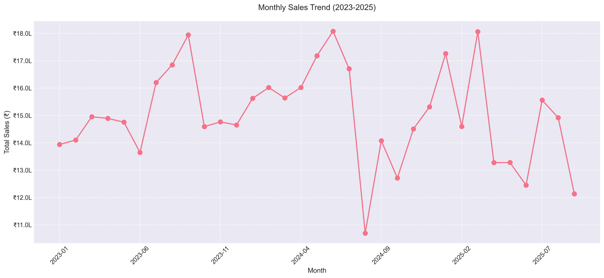
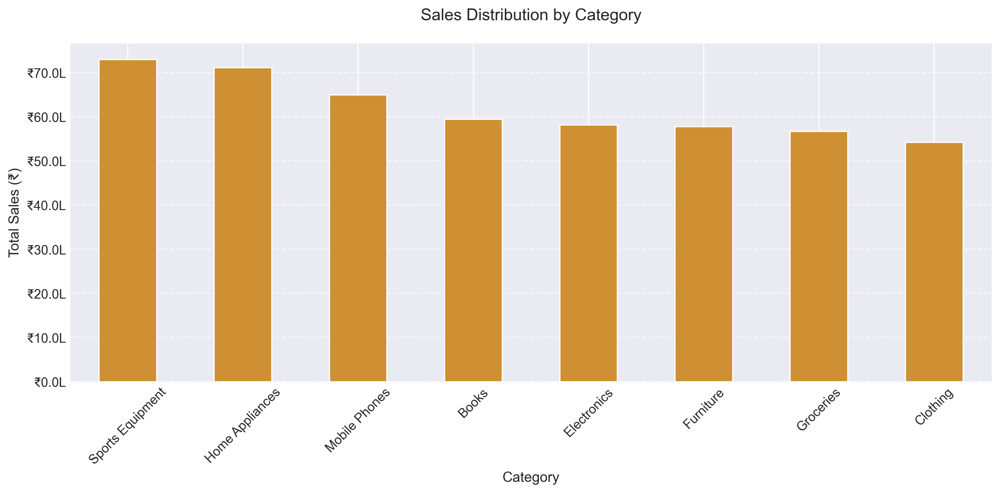

# indian_sales_plots
# **Indian Sales Analysis 📊**

## **Overview**
This project analyzes Indian retail sales data, generates meaningful insights, and visualizes trends using **Python, Pandas, Matplotlib, and Seaborn**. The dataset includes sales transactions from multiple cities and product categories in India.

## **Features**
- ✅ **Generate synthetic sales data** for analysis
- ✅ **Visualize sales trends** (line charts, bar plots, pie charts, heatmaps)
- ✅ **Format sales figures in Indian Rupees (₹)**
- ✅ **Compute insights** (best-selling category, city, average sales, GST collected)
- ✅ **Save results** as CSV and PNG files

---

## **Project Structure**
```
📂 Indian-Sales-Analysis  
├── indian_sales_analysis.py  # Main script  
├── indian_sales_data.csv  # Generated dataset  
├── indian_sales_plots/  # Directory for visualizations  
│   ├── monthly_sales_trend.png  
│   ├── category_sales.png  
│   ├── city_sales_pie.png  
│   ├── correlation_heatmap.png  
│   ├── daily_sales_pattern.png  
│   └── category_sales_boxplot.png  
├── requirements.txt  # Required dependencies  
└── README.md  # Project documentation  
```

---

## **Installation & Usage**

### **1️⃣ Install Dependencies**
```sh
pip install -r requirements.txt
```

### **2️⃣ Run the Analysis**
```sh
python indian_sales_analysis.py
```

### **3️⃣ Output**
- **CSV File:** `indian_sales_data.csv`
- **Visualizations:** Saved in the `indian_sales_plots/` folder
- **Summary Report:** Printed in the console

---

## **Sample Visualizations 📈**
### **Monthly Sales Trend**


### **Category Sales Distribution**


---

## **Tech Stack 🛠**
- **Python** (Pandas, NumPy)
- **Matplotlib & Seaborn** (Visualization)
- **Git & GitHub** (Version Control)

---

## **Contributing 🤝**
Feel free to **fork** this repo, create a branch, and submit a **pull request**. Contributions are welcome! 🚀  

---

## **License 📚**
This project is **open-source** under the **MIT License**.

